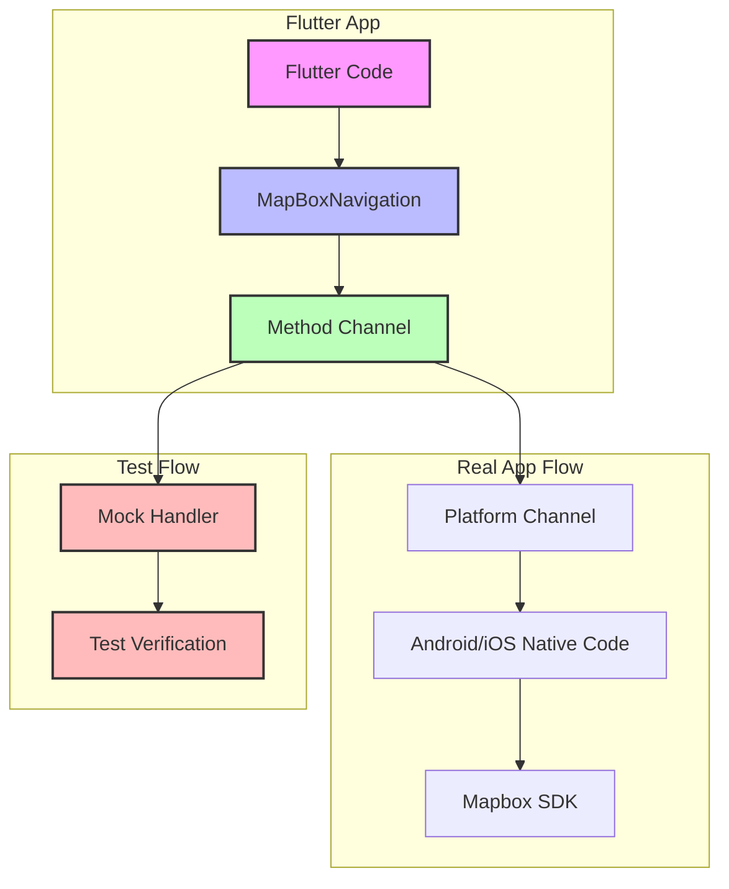

# Testing Architecture for Flutter Mapbox Navigation

## Overview

This document explains the testing architecture for the Flutter Mapbox Navigation package, focusing on how we test the communication between Flutter and platform-specific code.

## Architecture Diagram



## What We're Testing

In our integration tests, we are testing:

1. **Flutter Object Creation**
   - Correct instantiation of `WayPoint` objects
   - Proper handling of different parameter combinations
   - Validation of required fields

2. **Message Serialization**
   - Correct formatting of messages sent to the platform
   - Proper handling of different data types
   - Accurate representation of navigation options

3. **Method Channel Communication**
   - Verification that correct methods are called
   - Confirmation of proper parameter passing
   - Handling of method responses

## What We're NOT Testing

1. **Platform-Specific Code**
   - We don't test the actual Android/iOS native code
   - Platform-specific implementations are tested separately

2. **Mapbox SDK Integration**
   - We don't test the actual Mapbox SDK functionality
   - SDK integration is tested in platform-specific tests

3. **Real Navigation**
   - We don't test actual navigation functionality
   - Real navigation testing requires device testing

## Test Flow

1. **Setup**
   ```dart
   // Initialize test bindings
   TestWidgetsFlutterBinding.ensureInitialized();
   
   // Create navigation instance
   navigation = MapBoxNavigation.instance;
   
   // Set up mock handler
   setMockMethodCallHandler(channel, handler);
   ```

2. **Test Execution**
   ```dart
   // Create test objects
   final wayPoints = [WayPoint(...)];
   
   // Call navigation methods
   final result = await navigation.startNavigation(wayPoints: wayPoints);
   
   // Verify results
   expect(result, isTrue);
   ```

3. **Mock Handling**
   ```dart
   // Intercept platform calls
   switch (methodCall.method) {
     case 'buildRoute':
       return true; // Simulate success
   }
   ```

## Why This Approach?

1. **Isolation**
   - Tests focus on Flutter code behavior
   - Platform dependencies are removed
   - Faster and more reliable tests

2. **Coverage**
   - We can test all possible parameter combinations
   - Error cases can be easily simulated
   - Edge cases are more testable

3. **Maintenance**
   - Tests are platform-independent
   - Changes to platform code don't affect tests
   - Easier to update and maintain

## Best Practices

1. **Mock Responses**
   - Always return consistent mock responses
   - Simulate both success and failure cases
   - Match real platform behavior

2. **Test Coverage**
   - Test all public methods
   - Cover different parameter combinations
   - Include error cases

3. **Cleanup**
   - Always clean up mock handlers
   - Reset state between tests
   - Avoid test interdependence 